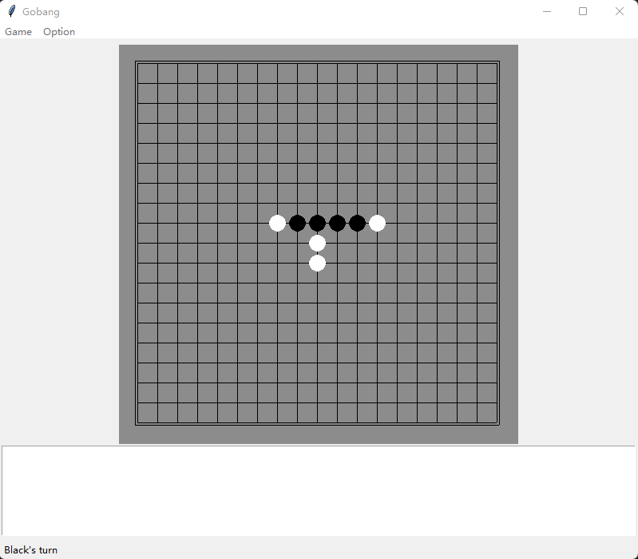

# gobang with python

> see: [chinese readme from csdn blog](https://blog.csdn.net/falwat/article/details/125116409)

## overview

This project implements a gobang game with GUI.

### features
- Interface using 'tkinter' design;
- Provides a simple Minxmax game algorithm;
- Both players of the game can be set manually through the mouse click;
- Both players of the game can be set to AI Agent
- The game supports automatic repeatedly start (easy to test AI algorithms);
- Easy to embed other algorithms;

### process
- Run 'gobang.py' to start the program;
- Click the menu "Option" to toggle the algorithm used by "Player 0" and" Player 1". "Player 0" is black," Player 1" is white. Default is "ManualAgent".
- if you need to start game repeatedly(used to test the algorithm performance), select menu "Game | repeat" for repetitions, the default is not repeated.
- click on the menu "Game | Start", Start the Game.
- in the process of the Game, you can click on the menu "Game | Restart" to Restart the Game.

### 文件组成

文件|说明
:-|:-
agent.py | `Agent` meta class
gobang_cli.py | gobang with cli.
gobang.py | `Gobang` class with GUI, This class inherits from `mainwindow.Mainwindow`.
mainwindow.py | `Mainwindow` class.
minimax.py | `Minimax` class, This class inherits from `agent.Agent`
random_agent.py | `RandomAgent` class for random play,  This class inherits from `agent.Agent`
utils.py | Utility classes and functions. Includes `check` for check winning, `show_board` for display the checkerboard, and `Piece` class for enumerate the pieces.

## About embedding your AI algorithm

You can easily embed your AI algorithm. All AI algorithms should inherit from the `agent.Agent` class, refer to `random_Agent.RandomAgent` class and `minimax.minimax` class design. Then add your AI algorithm to the `player_agents` list in `gobang.py`.